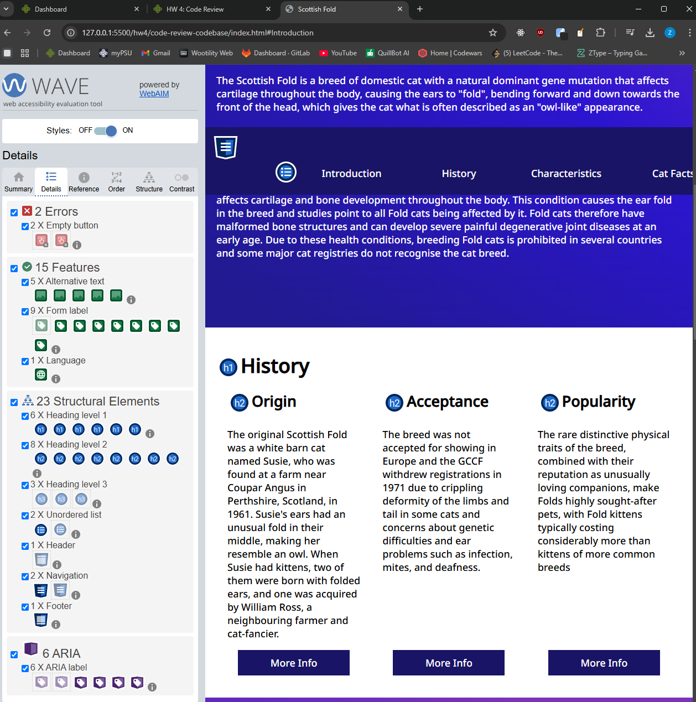
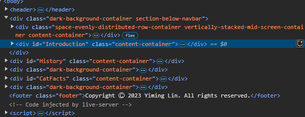
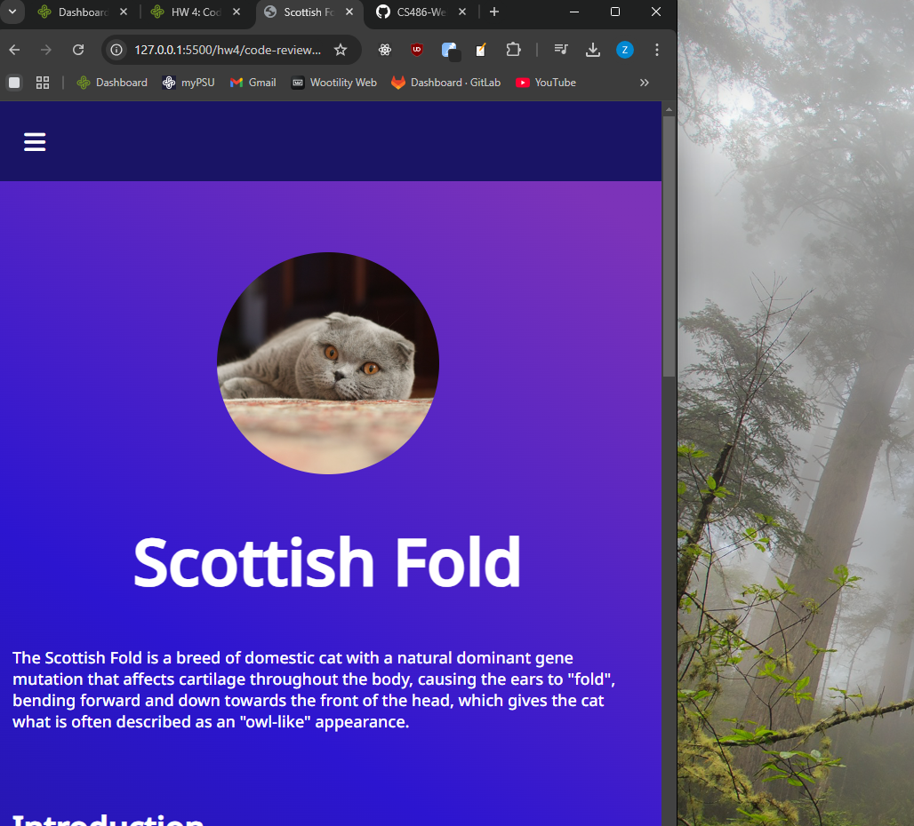

## Code Review Exercise

### Issue #1 Accessibility

The accessibility issue is no accessible label for screen reader for the "More Info" button. I found this issue by using Wave. While the code is descriptive, aria-label will improve accessibility. This is a issue because screen readers might misinterpret and overlook the button. 

Sol: Add an Aria Label for the button 




Initial code:

```html
<a class="more-info-button">More Info</a>
```

Updated code:

```html
<a class="more-info-button" aria-label="More information about origin">More Info</a>
```

### Issue #2: Use of ```<div>```:

The div tag is used instead of semantic elements like ```<article>``` and ```<section>``` for content sections. This is issue because semantics HTML improves SEO, readability and accessibility.

Sol: Replace non-semantic HTML tags with HTML elements 


<!-- Initial code: -->
```html
<div id="Introduction" class="content-container">
  <h1>Introduction</h1>
  <p>The Scottish Fold is...</p>
</div>
```

<!-- Updated code: -->
```html
<section id="Introduction" class="content-container" aria-labelledby="introduction-heading">
  <h1 id="introduction-heading">Introduction</h1>
  <p>The Scottish Fold is...</p>
</section>
```


## Issue #3: Navigation Bar Toggle 

The navigation bar for smaller screens does not collapse and expand correctly. Cause of the problem is from unlinked id for ```#navbar-toggle-trigger```. This is issue because user with smaller screen can't use or see the nav bar.

Sol: Ensure the input id is correctly linked to toggle logic 


Initial code:
```html
<input type="checkbox" class="navbar-toggle-trigger" id="navbar-toggle-trigger" />
```

<!-- Updated code: -->
 ```html
<input type="checkbox" class="navbar-toggle-trigger" id="navbar-toggle-trigger" aria-label="Toggle navigation" />
```


